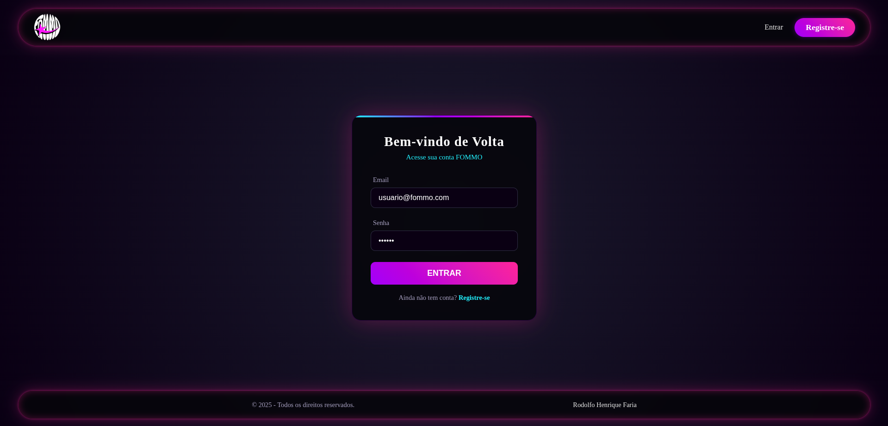
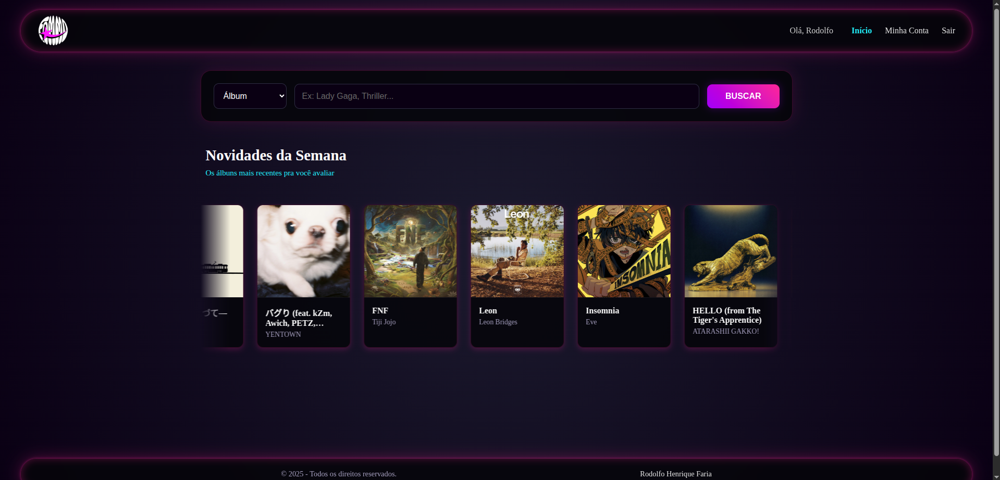
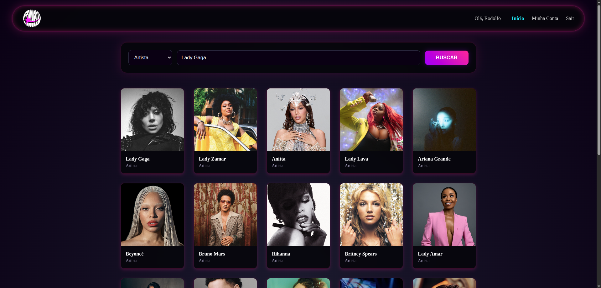
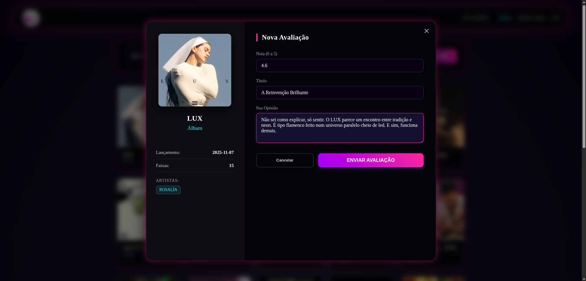
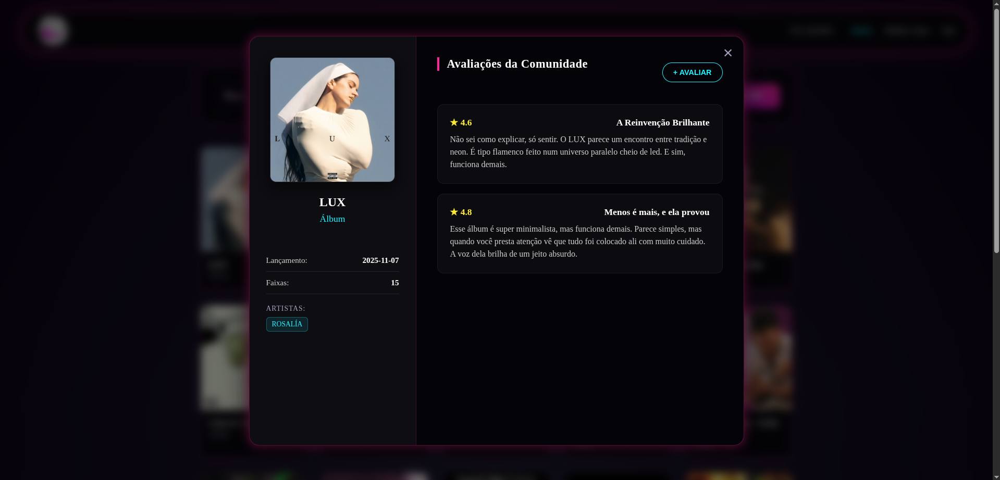
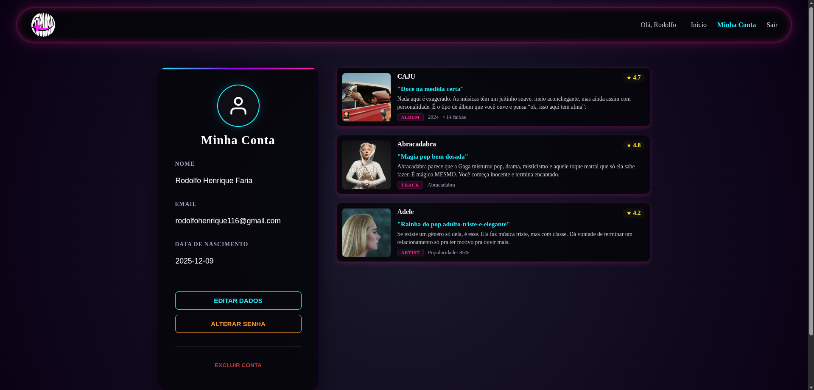
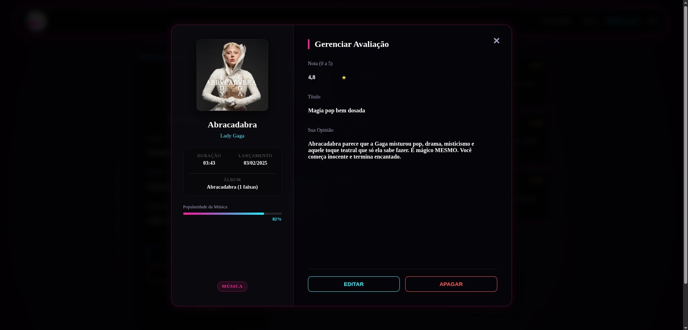

# FOMMO - Music Reviews Client 🎵

> "Fear Of Missing Music Out"

Bem-vindo ao client web do **FOMMO**, uma plataforma moderna de avaliação musical inspirada no Letterboxd. Este projeto é o Front-end (SPA) desenvolvido em **Angular**, focado em oferecer uma experiência imersiva com design **Cyberpunk/Dark Glass**, consumindo a API RESTful do FOMMO.

O sistema permite descobrir lançamentos do Spotify, buscar músicas, criar avaliações e gerenciar seu perfil com uma interface fluida e responsiva.

Este projeto foi desenvolvido como parte da disciplina de Programação Web da **UNIFEI**.

---

## 📸 Screenshots

Abaixo, apresentamos o fluxo completo de utilização da plataforma **FOMMO**.

### 1. Acesso e Identidade Visual
A porta de entrada da aplicação, apresentando o design system "Dark Glass" com validações em tempo real.


---

### 2. Dashboard: Novidades (Infinite Marquee)
Ao entrar, o usuário é recebido com as novidades da semana em um carrossel infinito animado via CSS.


---

### 3. Busca Integrada ao Spotify
Pesquisa de álbuns, artistas e músicas em tempo real. A grid de resultados conta com paginação manual ("Carregar Mais") para otimizar a performance.


---

### 4. Detalhes do Item
Ao clicar em um card, um modal se abre exibindo metadados ricos (capa, data, faixas, popularidade) consumidos da API do Spotify.


---

### 5. Criando uma Avaliação
O usuário pode registrar sua opinião. O formulário conta com tratamento para notas decimais e validação de campos.


---

### 6. Feedback Visual
Após a ação, o sistema lista as avaliações do card selecionado.


---

### 7. Perfil do Usuário
Área de gestão onde o usuário visualiza seus dados e o histórico de todas as suas avaliações. O menu lateral acompanha a rolagem da página (Sticky).


---

### 8. Edição e Gestão
Ao clicar em uma avaliação antiga, o usuário pode editar a nota/texto ou excluir o registro através de um modal dedicado.


---

## ✨ Principais Features

### 🎨 UX & Design System
* **Estilo Cyberpunk/Glassmorphism:** Interface construída com CSS moderno, utilizando transparências, blur (`backdrop-filter`) e cores neon vibrantes (#FF0099, #00F3FF).
* **Feedback Visual:** Uso de **Toasts Notifications** personalizados para sucesso/erro e Skeletons/Spinners para estados de carregamento.

### 🚀 Arquitetura Angular Moderna
* **Standalone Components:** Projeto livre de NgModules, utilizando a abordagem moderna do Angular.
* **Angular Signals:** Gerenciamento de estado reativo e granular para performance otimizada.
* **Control Flow (@if, @for):** Utilização da nova sintaxe de templates do Angular 17+.
* **Guards & Interceptors:** Proteção de rotas (`AuthGuard`) e injeção automática de Token JWT nas requisições.

### 🎧 Funcionalidades
* **Integração Spotify:** Busca em tempo real de Álbuns, Artistas e Faixas.
* **Infinite Scroll Logic:** Implementação manual de paginação ("Load More") para carregar resultados sob demanda sem perder o estado da lista.
* **Gestão de Avaliações:** CRUD completo de avaliações via Modais interativos.
* **Perfil:** Edição de dados, alteração de senha e exclusão de conta.

---

## 🛠️ Tecnologias Utilizadas

* **Framework:** Angular 20.3.11
* **Linguagem:** TypeScript
* **Consumo de API:** HttpClient
* **Gerenciamento de Estado:** Signals
* **Formulários:** Reactive Forms

---

## 🚦 Como Executar o Projeto

### 1. Pré-requisitos
* Node.js (LTS)
* Angular CLI instalado globalmente
* O **Backend do FOMMO** rodando localmente (Geralmente na porta 8080)

### 2. Instalação
```bash
# Clone o repositório
git clone [https://github.com/RodolfoFariia/fommo-frontend]

# Entre na pasta
cd fommo-front

# Instale as dependências
npm install
```

### 3. Execução
```bash
# Inicie o servidor de desenvolvimento
ng serve
```
Acesse `http://localhost:4200/` no seu navegador.

---

## 🔗 Integração com Backend

Este projeto depende da API FOMMO para funcionar.
Acesse o repositório da API aqui: [FOMMO Backend - GitHub](https://github.com/RodolfoFariia/fommo-project)

---

## 👨‍💻 Autor

Projeto desenvolvido por graduando em Ciência da Computação pela **UNIFEI**:

| **Rodolfo Henrique Faria** |
|:--------------------------:|
| [](https://www.linkedin.com/in/rodolfofaaria/) |
| [](https://github.com/RodolfoFariia) |
